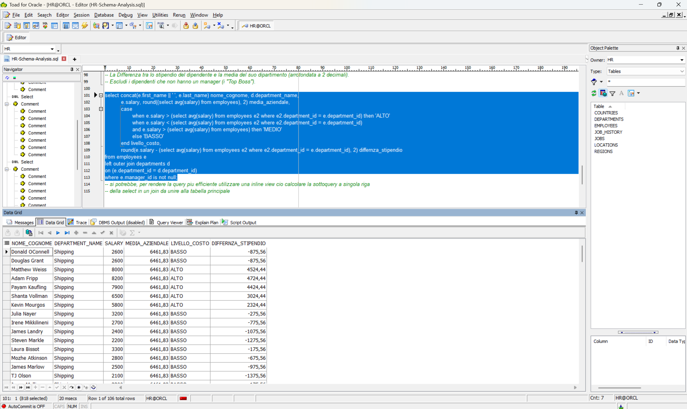

# Oracle-SQL-HR-Advanced-Analysis
Analisi dati avanzata su schema HR Oracle: Sottoquery correlate, Join complessi e logica di business senza Window Functions.

\# Oracle SQL: Advanced HR Data Analysis Portfolio 

Questo repository raccoglie una serie di analisi avanzate condotte sullo schema standard \*\*Oracle HR\*\*. Il progetto dimostra la capacità di tradurre requisiti di business complessi in query SQL efficienti e strutturate.

\## Competenze Tecniche Dimostrate

\* \*\*Sottoquery Avanzate:\*\* Utilizzo di sottoquery scalari correlate (nella `SELECT`).

\* \*\*Logica Condizionale:\*\* Implementazione di istruzioni `CASE WHEN` per la categorizzazione dei dati.

\* \*\*Integrità e Data Cleaning:\*\* Gestione proattiva dei valori `NULL` e delle criticità legate all'operatore `NOT IN`.

\* \*\*Analisi Statistica:\*\* Calcolo di medie ponderate, gap salariali e peer analysis senza l'ausilio di Window Functions.

\## Casi d'Uso Analizzati

\### Analisi Retributiva (Gap \& Bonus)

Ho sviluppato report per identificare anomalie salariali, confrontando lo stipendio del singolo dipendente con la media del dipartimento e dell'intera azienda.

\* \*\*Highlight:\*\* Identificazione dei dipendenti che guadagnano oltre il doppio della media del loro reparto.

\### Struttura Gerarchica e Turnover

Analisi delle date di assunzione tra dipendenti e manager (Self-Join) per identificare i "Veterani" aziendali e supportare la pianificazione delle successioni.

\### Filtri Geografici \& Performance

Aggregazione di dati su più tabelle (`JOIN` multipli) per analizzare le medie salariali in specifiche aree geografiche (es. USA).

---

\*\*Strumenti utilizzati:\*\* Oracle SQL Developer / SQL\*Plus / Toad for Oracle

